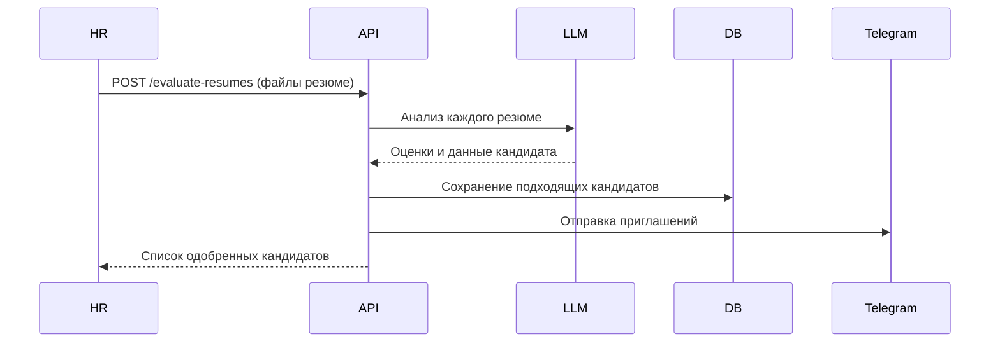
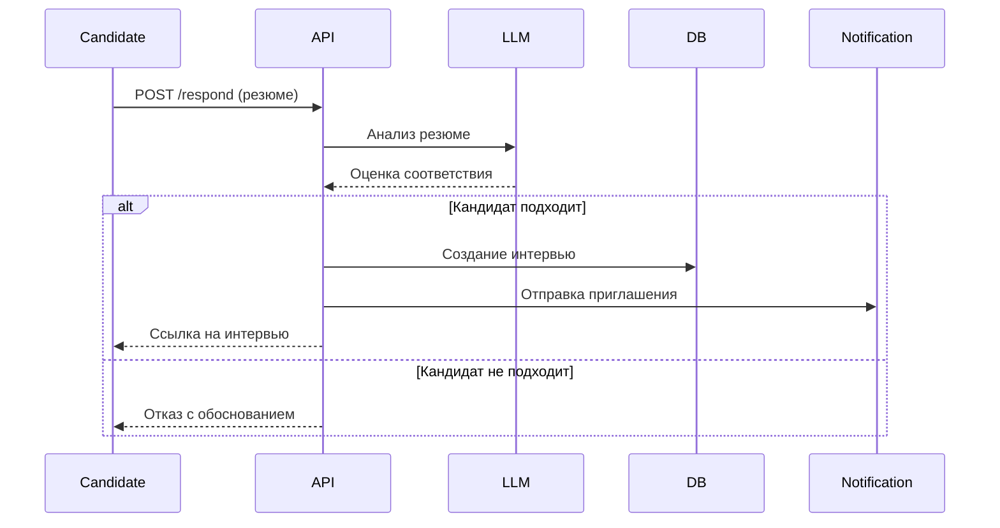
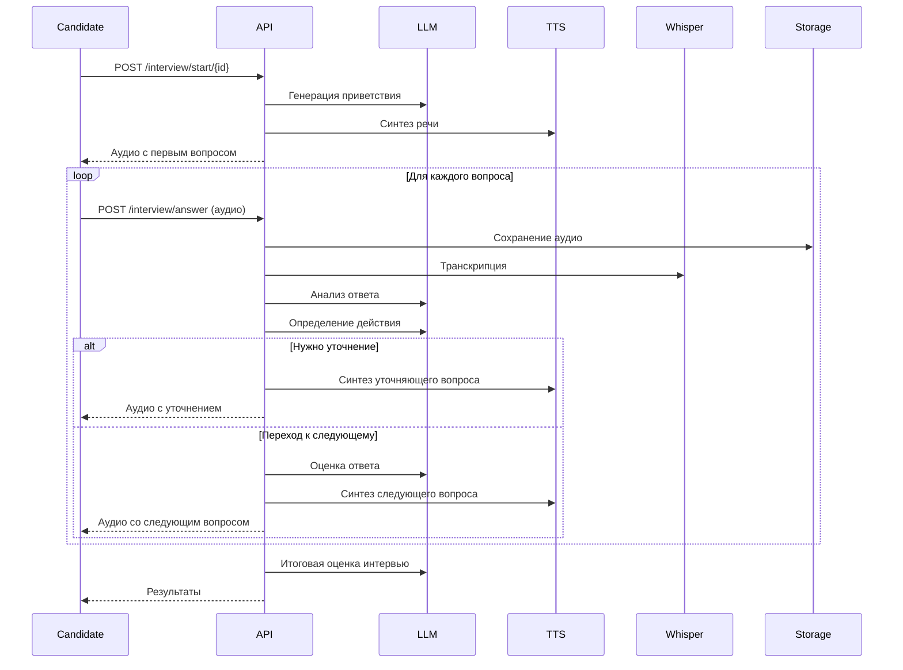

# VTBAIHR - Система автоматизации HR-процессов с ИИ

## 📋 Оглавление
1. [Обзор проекта](#обзор-проекта)
2. [Основные возможности](#основные-возможности)
3. [Технологический стек](#технологический-стек)
4. [Архитектура системы](#архитектура-системы)
5. [Основные сценарии использования](#основные-сценарии-использования)
6. [Модель данных и сущности](#модель-данных-и-сущности)
7. [API Endpoints](#api-endpoints)
8. [Система работы с ИИ](#система-работы-с-ии)
9. [Алгоритмы оценки](#алгоритмы-оценки)
10. [Система мониторинга](#система-мониторинга)

---

## 🎯 Обзор проекта

**VTBAIHR** - интеллектуальная система автоматизации HR-процессов, которая использует искусственный интеллект для проведения первичного скрининга кандидатов и автоматизированных голосовых интервью.

### Ключевые преимущества:
- 🤖 Автоматический анализ резюме с помощью GPT-4
- 🎙️ Голосовые интервью с ИИ-интервьюером
- 📊 Многокритериальная оценка кандидатов
- 📱 Интеграция с Telegram для уведомлений
- 📈 Полная обсервабельность через OpenTelemetry

---

## 💡 Основные возможности

### Для HR-специалистов:
- Создание и управление вакансиями с гибкой настройкой параметров
- Автоматическая генерация вопросов для интервью на основе описания вакансии
- Массовая загрузка и скрининг резюме
- Настройка весов критериев оценки для каждой вакансии
- Просмотр результатов интервью с детальной аналитикой

### Для кандидатов:
- Простая подача заявки на вакансию
- Прохождение голосового интервью в удобное время
- Получение уведомлений через Telegram или email
- Автоматическая транскрипция и анализ ответов

---

## 🛠 Технологический стек

### Backend
- **Python 3.11+** - основной язык разработки
- **FastAPI** - веб-фреймворк для построения API
- **SQLAlchemy** + **asyncpg** - асинхронная работа с PostgreSQL
- **Uvicorn** - ASGI сервер

### Базы данных и хранилища
- **PostgreSQL** - основная база данных
- **Redis** - кеширование и дедупликация алертов
- **WeedFS** - распределенное хранилище для файлов (резюме, аудио)

### ИИ и обработка данных
- **OpenAI GPT-4** - анализ резюме и генерация вопросов
- **Whisper** - транскрипция аудио
- **TTS (Text-to-Speech)** - синтез речи для ИИ-интервьюера
- **pypdf** + **pdf2image** - обработка PDF-резюме

### Интеграции
- **Telegram API (Telethon)** - отправка уведомлений
- **SMTP** - email-уведомления
- **OpenTelemetry** - трейсинг, метрики, логирование

### Мониторинг
- **Grafana** - визуализация метрик
- **Loki** - агрегация логов  
- **Tempo** - распределенный трейсинг
- **OTEL Collector** - сбор телеметрии

---

## 🏗 Архитектура системы

### Слоистая архитектура (Clean Architecture)

```
┌─────────────────────────────────────────────────────┐
│                   HTTP Layer                        │
│                FastAPI + Middleware                 │
├─────────────────────────────────────────────────────┤
│                Controller Layer                     │
│    VacancyController │ InterviewController          │
├─────────────────────────────────────────────────────┤
│                 Service Layer                       │
│  VacancyService │ InterviewService │ PromptGen      │
├─────────────────────────────────────────────────────┤
│                Repository Layer                     │
│        VacancyRepo │ InterviewRepo                  │
├─────────────────────────────────────────────────────┤
│              Infrastructure Layer                   │
│   PostgreSQL │ Redis │ WeedFS │ OpenAI │ Telegram  │
└─────────────────────────────────────────────────────┘
```

### Структура проекта

```
vtbaihr/
├── internal/              # Бизнес-логика
│   ├── app/              # Инициализация приложения
│   ├── config/           # Конфигурация
│   ├── controller/       # HTTP контроллеры
│   ├── service/          # Бизнес-сервисы
│   ├── repo/            # Репозитории для работы с БД
│   ├── model/           # Модели данных и сущности
│   └── interface/       # Интерфейсы (Protocol)
├── infrastructure/       # Инфраструктурный код
│   ├── pg/              # PostgreSQL клиент
│   ├── redis_client/    # Redis клиент
│   ├── weedfs/          # WeedFS клиент
│   └── telemetry/       # OpenTelemetry
├── pkg/                 # Внешние клиенты
│   └── client/external/
│       ├── openai/      # OpenAI GPT клиент
│       ├── telegram/    # Telegram клиент
│       └── email/       # Email клиент
└── main.py              # Точка входа
```

---

## 📋 Основные сценарии использования

### Сценарий 1: Массовая загрузка резюме (HR)



**Процесс:**
1. HR загружает пачку резюме через endpoint `/evaluate-resumes`
2. Система анализирует каждое резюме через GPT-4
3. Извлекает контактные данные (email, телефон, Telegram)
4. Оценивает соответствие вакансии по критериям
5. Создает интервью для подходящих кандидатов
6. Отправляет приглашения через Telegram/Email

### Сценарий 2: Отклик кандидата



### Сценарий 3: Прохождение ИИ-интервью



---

## 📊 Модель данных и сущности

### Основные сущности

#### 1. **Vacancy** (Вакансия)
```python
- id: int                    # ID вакансии
- name: str                  # Название позиции
- tags: list[str]           # Теги/навыки
- description: str          # Описание вакансии
- red_flags: str            # Красные флаги
- skill_lvl: SkillLevel     # Уровень (junior/middle/senior/lead)
- created_at: datetime
```

#### 2. **VacancyQuestion** (Вопрос для интервью)
```python
- id: int
- vacancy_id: int           # Привязка к вакансии
- question: str             # Текст вопроса
- hint_for_evaluation: str  # Подсказка для оценки
- weight: int               # Вес вопроса (1-10)
- question_type: QuestionsType  # Тип (soft/hard/soft-hard)
- response_time: int        # Время на ответ в минутах
```

#### 3. **Interview** (Интервью)
```python
- id: int
- vacancy_id: int
- candidate_email: str
- candidate_name: str
- candidate_phone: str
- candidate_telegram_login: str
- candidate_resume_fid: str     # ID файла в WeedFS
- candidate_resume_filename: str
# Оценки по резюме
- accordance_xp_vacancy_score: int      # Соответствие опыта
- accordance_skill_vacancy_score: int   # Соответствие навыков
# Оценки по интервью
- red_flag_score: int           # Оценка красных флагов
- hard_skill_score: int         # Технические навыки
- soft_skill_score: int         # Soft skills
- logic_structure_score: int    # Логика и структура ответов
- accordance_xp_resume_score: int    # Соответствие опыта резюме
- accordance_skill_resume_score: int # Соответствие навыков резюме
# Итоги
- strong_areas: str             # Сильные стороны
- weak_areas: str               # Слабые стороны
- approved_skills: list[str]    # Подтвержденные навыки
- general_score: float          # Общий балл (0-10)
- general_result: GeneralResult # Результат (next/rejected/disputable)
- message_to_candidate: str     # Сообщение кандидату
- message_to_hr: str            # Сообщение HR
```

#### 4. **InterviewWeights** (Веса критериев интервью)
```python
- vacancy_id: int
- logic_structure_score_weight: int
- soft_skill_score_weight: int
- hard_skill_score_weight: int
- accordance_xp_resume_score_weight: int
- accordance_skill_resume_score_weight: int
- red_flag_score_weight: int
```

#### 5. **ResumeWeights** (Пороги для резюме)
```python
- vacancy_id: int
- accordance_xp_vacancy_score_threshold: int     # Порог по опыту
- accordance_skill_vacancy_score_threshold: int  # Порог по навыкам
- recommendation_weight: int                     # Вес рекомендаций
- portfolio_weight: int                          # Вес портфолио
```

#### 6. **CandidateAnswer** (Ответ кандидата)
```python
- id: int
- question_id: int
- interview_id: int
- response_time: int         # Время ответа
- message_ids: list[int]     # ID сообщений диалога
- message_to_candidate: str  # Фидбек кандидату
- message_to_hr: str         # Фидбек HR
- score: int                 # Оценка (0-10)
```

#### 7. **InterviewMessage** (Сообщение в интервью)
```python
- id: int
- interview_id: int
- question_id: int
- audio_fid: str            # ID аудио в WeedFS
- audio_name: str           # Имя файла
- role: str                 # user/assistant
- text: str                 # Транскрипция
- created_at: datetime
```

---

## 🔌 API Endpoints

### Управление вакансиями

| Метод | Endpoint | Описание |
|-------|----------|----------|
| POST | `/create` | Создание вакансии |
| DELETE | `/delete/{vacancy_id}` | Удаление вакансии |
| PUT | `/edit` | Редактирование вакансии |
| GET | `/all` | Получение всех вакансий |
| POST | `/generate-tags` | Генерация тегов по описанию |

### Управление вопросами

| Метод | Endpoint | Описание |
|-------|----------|----------|
| POST | `/question/add` | Добавление вопроса |
| PUT | `/question/edit` | Редактирование вопроса |
| DELETE | `/question/delete/{id}` | Удаление вопроса |
| POST | `/question/generate` | Генерация вопросов ИИ |
| GET | `/question/all/{vacancy_id}` | Все вопросы вакансии |
| GET | `/question/{question_id}` | Получение вопроса |

### Настройка весов оценки

| Метод | Endpoint | Описание |
|-------|----------|----------|
| POST | `/interview-weights/create` | Создание весов интервью |
| PUT | `/interview-weights/edit` | Изменение весов интервью |
| GET | `/interview-weights/{vacancy_id}` | Получение весов |
| POST | `/resume-weights/create` | Создание порогов резюме |
| PUT | `/resume-weights/edit` | Изменение порогов |
| GET | `/resume-weights/{vacancy_id}` | Получение порогов |

### Работа с кандидатами

| Метод | Endpoint | Описание |
|-------|----------|----------|
| POST | `/evaluate-resumes` | Массовая оценка резюме |
| POST | `/respond` | Отклик кандидата |

### Проведение интервью

| Метод | Endpoint | Описание |
|-------|----------|----------|
| POST | `/interview/start/{id}` | Начало интервью |
| POST | `/interview/answer` | Отправка ответа |
| GET | `/interview/vacancy/{vacancy_id}` | Все интервью вакансии |
| GET | `/interview/{interview_id}` | Получение интервью |
| GET | `/interview/{id}/details` | Детали интервью |
| GET | `/interview/audio/{fid}/{name}` | Скачать аудио |
| GET | `/interview/resume/{fid}/{name}` | Скачать резюме |

### Telegram интеграция

| Метод | Endpoint | Описание |
|-------|----------|----------|
| GET | `/telegram/qr/generate` | Генерация QR для входа |
| GET | `/telegram/qr/status` | Статус авторизации |
| POST | `/telegram/start` | Запуск клиента |

---

## 🤖 Система работы с ИИ

### Архитектура промптов

Система использует специализированные промпты для разных этапов:

#### 1. **Генерация вопросов** (`get_question_generation_prompt`)
- Входные данные: описание вакансии, уровень, теги
- Генерирует вопросы с учетом типа (soft/hard) и уровня сложности
- Выход: JSON с вопросами, подсказками для оценки и весами

#### 2. **Оценка резюме** (`get_resume_evaluation_system_prompt`)
- Анализирует соответствие резюме требованиям вакансии
- Извлекает контактные данные кандидата
- Оценивает по критериям:
  - Соответствие опыта (0-5)
  - Соответствие навыков (0-5)
  - Наличие красных флагов (0-5)
- Выход: JSON с оценками и контактами

#### 3. **Приветствие в интервью** (`get_hello_interview_system_prompt`)
- Генерирует персонализированное приветствие
- Объясняет процесс интервью
- Задает первый вопрос

#### 4. **Управление интервью** (`get_interview_management_system_prompt`)
- Анализирует ответ кандидата
- Определяет действие:
  - `delve_into_question` - углубиться в вопрос
  - `next_question` - перейти к следующему
  - `finish_interview` - завершить интервью
- Генерирует следующую реплику

#### 5. **Оценка ответа** (`get_answer_evaluation_system_prompt`)
- Оценивает качество и полноту ответа (0-10)
- Генерирует фидбек для кандидата и HR

#### 6. **Итоговая оценка** (`get_interview_summary_system_prompt`)
- Анализирует все интервью целиком
- Оценивает по 6 критериям
- Выявляет сильные/слабые стороны
- Формирует финальную рекомендацию

### Обработка файлов

#### PDF резюме
- **Vision модели (GPT-4o)**: конвертация в изображения через pdf2image
- **Текстовые модели**: извлечение текста через pypdf
- Автоматический выбор метода в зависимости от модели

#### Аудио
- **Транскрипция**: Whisper API для перевода речи в текст
- **Синтез речи**: TTS API для озвучивания вопросов
- Настройки: голос "alloy", скорость 0.85x

---

## 📐 Алгоритмы оценки

### Формула общего балла интервью

```python
def calculate_general_score(scores, weights):
    # Инверсия red_flag_score (чем больше флагов, тем хуже)
    inverted_red_flag = 5 - scores.red_flag
    
    # Взвешенная сумма
    weighted_sum = (
        inverted_red_flag * weights.red_flag +
        scores.hard_skill * weights.hard_skill +
        scores.soft_skill * weights.soft_skill +
        scores.logic_structure * weights.logic_structure +
        scores.accordance_xp * weights.accordance_xp +
        scores.accordance_skill * weights.accordance_skill
    )
    
    # Нормализация к диапазону 0-10
    total_weight = sum(weights)
    max_possible = 5 * total_weight
    general_score = (weighted_sum / max_possible) * 10
    
    return general_score
```

### Классификация результатов

- **general_score >= 7** → `NEXT` (рекомендован к следующему этапу)
- **general_score >= 5** → `DISPUTABLE` (спорный кандидат)
- **general_score < 5** → `REJECTED` (отклонен)

### Пороговые значения для резюме

Кандидат проходит на интервью, если:
- `accordance_xp_vacancy_score >= threshold_xp` И
- `accordance_skill_vacancy_score >= threshold_skill`

Пороги настраиваются индивидуально для каждой вакансии.

---

## 📡 Система мониторинга

### OpenTelemetry интеграция

#### Трейсинг
- Автоматический трейсинг всех HTTP запросов
- Кастомные spans для бизнес-операций
- Контекст propagation между сервисами
- Интеграция с Tempo для визуализации

#### Метрики
- **HTTP метрики:**
  - `http.server.request.duration` - длительность запросов
  - `http.server.active_requests` - активные запросы
  - `http.server.ok.request.total` - успешные запросы
  - `http.server.error.request.total` - ошибки
- **Telegram метрики:**
  - `telegram.server.message.duration`
  - `telegram.server.ok.message.total`
  - `telegram.server.error.message.total`

#### Логирование
- Структурированные логи с trace_id и span_id
- Автоматическая корреляция с трейсами
- Уровни: DEBUG, INFO, WARNING, ERROR
- Экспорт в Loki

### Alert Manager

Система автоматических уведомлений в Telegram при ошибках:
- Дедупликация через Redis (30 сек)
- Ссылки на Grafana для быстрого анализа
- Отправка в отдельный thread чата мониторинга

---

## 🔧 Ключевые технические решения

### 1. Асинхронная архитектура
- Полностью асинхронный код на asyncio
- AsyncSQLAlchemy для работы с БД
- Асинхронные HTTP клиенты

### 2. Clean Architecture
- Разделение на слои (Controller → Service → Repository)
- Dependency Injection через конструкторы
- Protocol-based интерфейсы для тестируемости

### 3. Распределенное хранилище
- WeedFS для хранения больших файлов
- Эффективная репликация и масштабирование
- Прямые ссылки для скачивания

### 4. Обработка ошибок
- Graceful degradation при недоступности сервисов
- Retry логика для внешних API
- Подробное логирование всех исключений

### 5. Безопасность
- Параметризованные SQL запросы
- Валидация входных данных через Pydantic
- Шифрование sensitive данных

---

## 🚀 Быстрый старт для разработчика

### Основные точки входа в код:

1. **main.py** - инициализация всех компонентов
2. **internal/app/http/app.py** - регистрация роутов
3. **internal/service/interview/service.py** - логика интервью
4. **internal/service/vacancy/service.py** - логика работы с вакансиями
5. **internal/service/*/prompt.py** - промпты для LLM

### Ключевые конфигурационные переменные:
- `VTBAIHR_VACANCY_PORT` - порт сервера
- `VTBAIHR_VACANCY_PREFIX` - префикс API
- `VTBAIHR_OPENAI_API_KEY` - ключ OpenAI
- `VTBAIHR_TG_API_ID/HASH` - Telegram credentials

---

## 📝 Примеры использования

### Создание вакансии с автогенерацией вопросов:
```bash
# 1. Создаем вакансию
POST /api/vacancy/create
{
  "name": "Python Developer",
  "tags": ["Python", "FastAPI", "PostgreSQL"],
  "description": "...",
  "red_flags": "Отсутствие опыта с async",
  "skill_lvl": "middle"
}

# 2. Генерируем вопросы
POST /api/vacancy/question/generate
{
  "vacancy_id": 1,
  "questions_type": "soft-hard",
  "count_questions": 5
}

# 3. Настраиваем веса
POST /api/vacancy/interview-weights/create
{
  "vacancy_id": 1,
  "hard_skill_score_weight": 10,
  "soft_skill_score_weight": 5,
  ...
}
```

### Массовый скрининг:
```bash
POST /api/vacancy/evaluate-resumes
Content-Type: multipart/form-data

vacancy_id: 1
candidate_resume_files: [resume1.pdf, resume2.pdf, ...]
```

---

## 🎯 Итоги

VTBAIHR представляет собой комплексное решение для автоматизации HR-процессов с использованием современных технологий ИИ. Система обеспечивает полный цикл от публикации вакансии до проведения интервью и оценки кандидатов, значительно сокращая время и ресурсы HR-департамента при сохранении качества отбора.